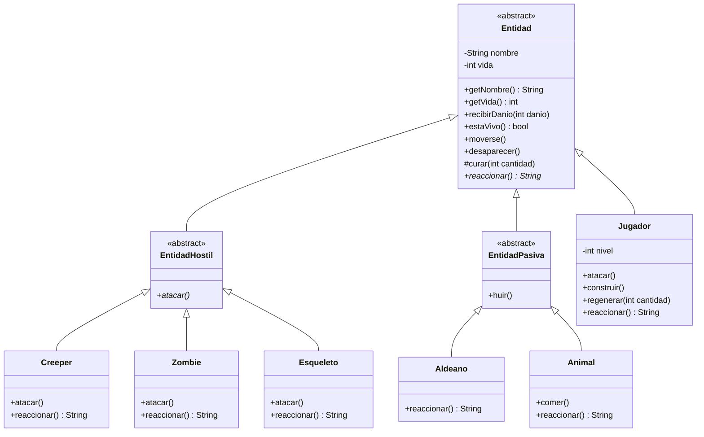

# Minecraft API — Taller de Git 2026

API REST hecha con Spring Boot que expone el modelado de clases de Minecraft
visto en las clases del 2 y 3 de septiembre (herencia, sobreescritura y
ocultamiento de la información), como parte del Taller de Git.

## Tecnologías

- Java 21
- Spring Boot 3 (Spring Web)
- Maven

## Cómo correr el proyecto

```bash
git clone https://github.com/CeciBasu/clbasualdo-tplp3-2026.git
cd clbasualdo-tplp3-2026/minecraft
./mvnw spring-boot:run
```

La aplicación queda disponible en `http://localhost:8080`.

## Modelo de dominio

El modelo trata cualquier entidad de forma uniforme (moverse, recibir daño,
desaparecer, reaccionar ante el jugador) sin preguntar de qué tipo concreto
se trata. Las reglas de vida, movimiento y muerte viven en `Entidad`, la
clase base: cada subclase solo redefine lo que realmente cambia.

`nombre` y `vida` son `private`: nadie fuera de la jerarquía puede dejar una
entidad en un estado inválido, ni siquiera las propias hijas. El estado
cambia únicamente a través de mensajes (`recibirDanio`, `curar`) que
validan lo que reciben. `curar()` es `protected` porque no es una operación
que cualquier entidad deba poder recibir desde afuera (un `Creeper` no se
regenera): es una herramienta interna de la jerarquía que usa `Jugador`.

`reaccionar()` es un método abstracto declarado en `Entidad`: expresa un
comportamiento que todas las hijas deben saber responder, pero cuya forma
concreta no puede escribir el padre porque cada tipo se comporta distinto
(un `Creeper` explota, un `Esqueleto` dispara, un `Aldeano` huye).



## Endpoints

| Método | Ruta | Descripción |
|---|---|---|
| `GET` | `/` | Confirma que el servicio está vivo. |
| `GET` | `/esqueleto?nombre=...&vida=...` | Construye un `Esqueleto` con los parámetros de la URL y devuelve su estado en JSON. |
| `GET` | `/comportamiento` | Devuelve, en JSON, la reacción de un `Creeper` y un `Aldeano` frente al jugador. Ambos se tratan como `Entidad`: no hay ningún `if` por tipo, cada objeto informa lo suyo. |

### Ejemplo — `GET /esqueleto?nombre=Bony&vida=15`

```json
{
  "nombre": "Bony",
  "vida": 15,
  "vivo": true
}
```

### Ejemplo — `GET /comportamiento`

```json
[
  {
    "tipo": "Creeper",
    "reaccion": "Creeper se acerca silbando y está a punto de explotar."
  },
  {
    "tipo": "Aldeano",
    "reaccion": "Aldeano se asusta y corre a esconderse."
  }
]
```

## Licencia

Este proyecto está bajo licencia Apache 2.0. Ver [LICENSE](./LICENSE).
